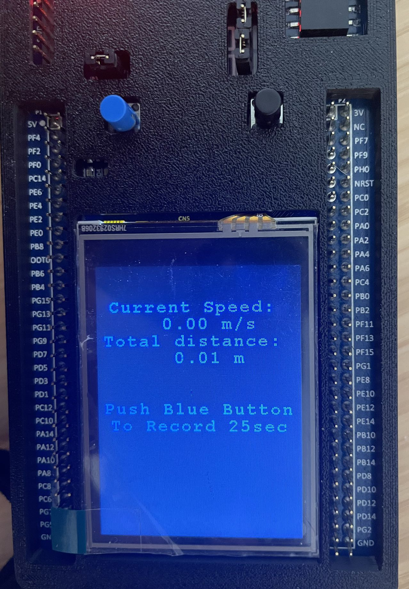

# STM32-Gyrometer-proj

NYU ECE-6483 Embeded System Challenge

Group member: Chen XU(cx2214), Shuning LI(sl10916),

### Gyro Data Collection

##### Raw Data

<u>%% TO-DO: 分析如何获取数据</u>

##### Smoothen Data

<u>%% TO-DO: 分析如何平滑数据</u>

### Algorithm

The algorithm to calculate the distance traveled with anglur velocity is based on chord length of the walking movement. We used the data collected from gyroscope and measure the distance with angle moved on each step. 

 $c=2r⋅sin(θ/2)$ 

where *c* is the chord length, *θ* is the central angle in radians, and *r* is the radius.

##### Analog analysis

Steps can be broken down to two parts: left leg move forward, and right leg move forward. 

The little circle refers to board attached to a person, and the leg marked in double line refers to the leg which our board attached to. Assume each step of this person moves a same distance.

Case 1: leg with board moves

The angular degree velocity of this move is collected with gyrometer, and this move results in a spark on z-axis on our gyrometer. It can be infered that the distance traveled can be calculated if we know user’s leg lenght $L$. So we can measure distance with $Distance_1 = 2L⋅sin(θ/2)$ . However we leave a gap here, but it should be filled with case 2.

Case 2: leg without board moves

Similar to case 1, we can measure distance traveled with $Distance_2 = 2L⋅sin(θ/2)$. Filling up the gap in case 1.

Continously, we can see that we already fill up the gap between the distance of these two cases. So the  general algorithm is $Distance = 2L⋅sin(θ/2)$

##### Adaptive threshold

In real-world case, data can vary between different users: height, leg length, and step length. There is no generalized interval for how our data could go. So we developed an adaptive threshold to dissolve this issue. 

A typical data pattern looks like this. Where the pattern while walking pattern jitters up to ~4000 and down to -2000, and the pattern while standing-still jitters ~800. Notice that this data can vary on users, it could be ~10,000, or it could be ~2000. 

We record the peak angular speed in every run, and use 5% of that peak as our thershold. If the user is hitting over 5% of his/her previous peak, then we consider him/her walking and measure the distance traveled; otherwise, we consider him/her standing still and stop measuring distance.

### Creativity

##### Real-Time LCD display

We developed a nice-to-have LCD display to show how many distance traveled. It is developed on [BSP_DISCO_F429ZI](https://os.mbed.com/users/SomeRandomBloke/code/BSP_DISCO_F429ZI/), contributed by [Andrew Lindsay](https://os.mbed.com/users/SomeRandomBloke/).

<u>%% TO-DO: 或许能提出更多的创意点？</u>
