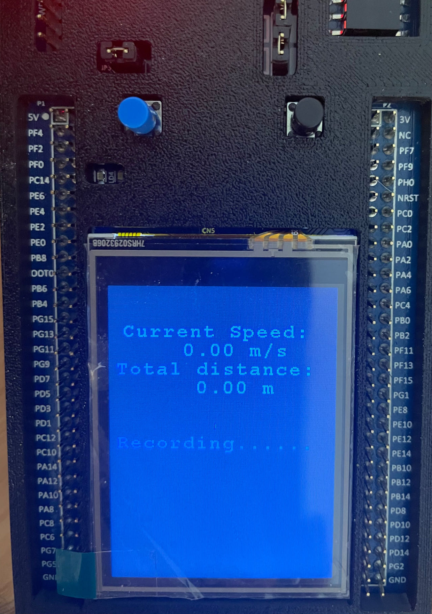
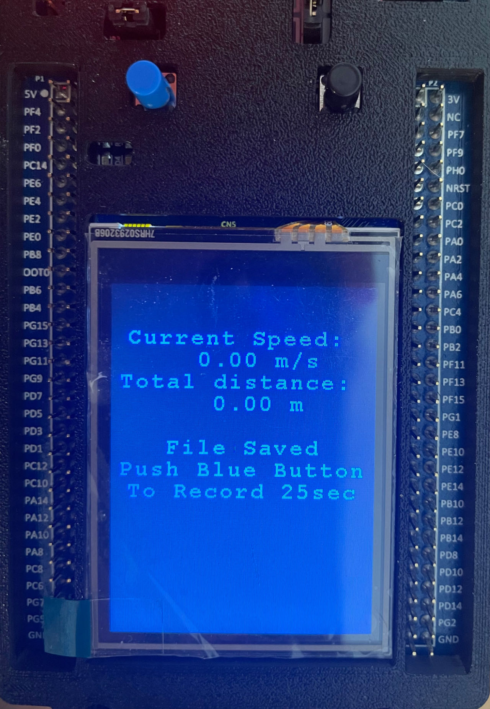
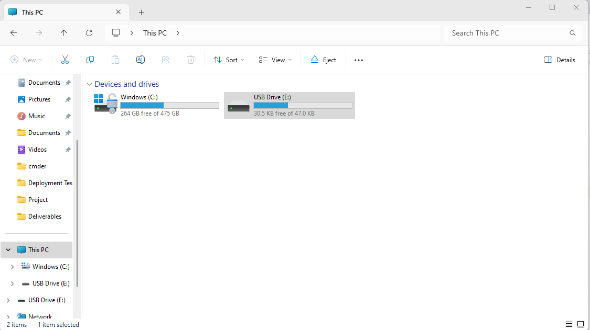
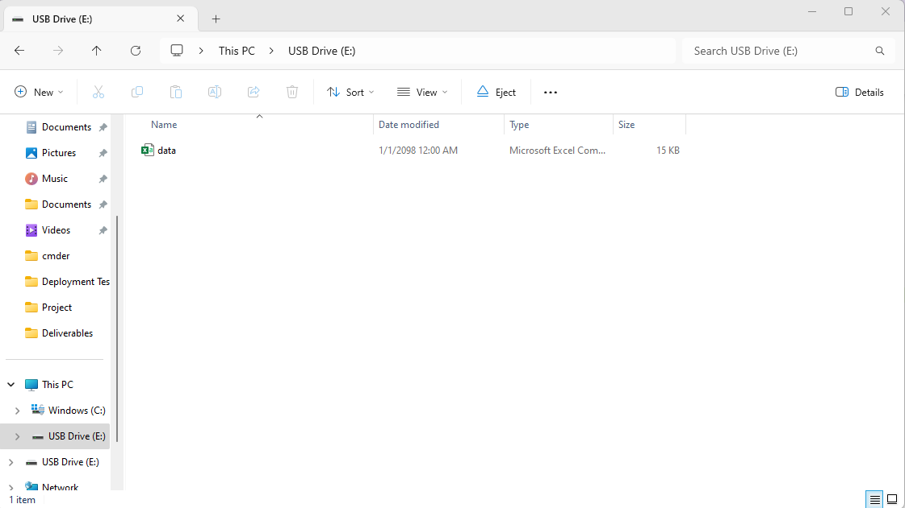

# STM32-Gyrometer-proj

This project aimed to develop a wareable device to measure distance and speed of walking with board STM32F429I with Gyroscope I3G4250D. With the angular velocity data, an algorithm to calculate the distance traveled is developed with the analysis of leg placement while walking. In consideration of real-life use cases, an user-friendly design is developed, users can press a single button to start/stop the measurement. In addition, the LCD screen is utilized to show live data, including current speed and total distance. Data log during a measurement is saved to CSV file and could be exported via USB connection. 

A demo video can be found on [YouTube](https://youtu.be//f3MMmMKtFfY).

## Algorithm

The algorithm to calculate the distance traveled with anglur velocity is based on chord length of the walking movement. We used the data collected from gyroscope and measure the distance with angle moved on each step. 

 $c=2r⋅sin(θ/2)$ 

where *c* is the chord length, *θ* is the central angle in radians, and *r* is the radius.

### Analog analysis

Steps can be broken down to two parts: left leg move forward, and right leg move forward. 

The little circle refers to board attached to a person, and the leg marked in double line refers to the leg which our board attached to. Assume each step of this person moves a same distance.

**Case 1: leg with board moves**

The angular degree velocity of this move is collected with gyrometer, and this move results in a spark on z-axis on our gyrometer. It can be infered that the distance traveled can be calculated if we know user’s leg lenght $L$. So we can measure distance with $Distance_1 = 2L⋅sin(θ/2)$ . However we leave a gap here, but it should be filled with case 2.

**Case 2: leg without board moves**

Similar to case 1, we can measure distance traveled with $Distance_2 = 2L⋅sin(θ/2)$. Filling up the gap in case 1.

Continously, we can see that we already fill up the gap between the distance of these two cases. So the  general algorithm is $Distance = 2L⋅sin(θ/2)$

### Adaptive threshold

In real-world case, data can vary between different users: height, leg length, and step length. There is no generalized interval for how our data could go. So we developed an adaptive threshold to dissolve this issue. 

A typical data pattern looks like this. Where the pattern while walking pattern jitters up to ~4000 and down to -2000, and the pattern while standing-still jitters ~800. Notice that this data can vary on users, it could be ~10,000, or it could be ~2000. 

We record the peak angular speed in every run, and use 5% of that peak as our thershold. If the user is hitting over 5% of his/her previous peak, then we consider him/her walking and measure the distance traveled; otherwise, we consider him/her standing still and stop measuring distance.

### Smoothen Velocity w.t. sliding window

In this project, a live speed indicator is developed to show current speed. In most cases, the live speed is full of sparks and damps, making the display inaccurate and unreadable. 

We applied sliding window to smoothen the speed indicator. The borad records 20s of speed data in the speed table with default length 40. The most recent maximum speed data within 1500ms is selected and displayed. The speed window can be changed with SPEED_WINDOW. The speed less than 0.05m/s is ignored.

## USB export

In addition to being able to see the speed and distance on the LCD screen, the user can also start saving a piece of 25-second data by pushing the blue button on the board (LCD would display a two line instruction to inform the user about this). Once the button is pressed, previous speed and distance would be reset and timer would start running. When the timer is up, a csv file would be saved to a FAT file system built on the RAM. To achieve this, we utilized mbed's HeapBlockDevice https://os.mbed.com/docs/mbed-os/v5.15/apis/heapblockdevice.html and FATFileSystem https://os.mbed.com/docs/mbed-os/v5.15/apis/fatfilesystem.html API, and allocated a 64kB memory space for the FileSystem - the MCU has 256kB RAM and the code used less than 30kB after compiling so we have enough space. We have also taken into consideration that it would be very inconvenient to carry a laptop around for data exporting, therefore we used mbed's USBMSD https://os.mbed.com/docs/mbed-os/v6.16/apis/usbmsd.html API, and configured the target so that we could use the board as a mass-storage disk through the USB micro-AB connector. 

The user can first fasten the board (powered by a battery bank through the USB mini connector) to right above the knee, and then push the button to start a recording. The LCD display will change to "Recording......" to indicate the data is being recorded, and when 25 second is up, LCD would display "File Saved" to let the user know that data is ready to be exported. 

LCD display when blue button pushed. 

LCD when 25 second timer is up. 

The board can be unfastened and with the battery bank still connected through the mini-USB cable, it can be connected to a PC through the micro-AB connector. It would be recoginized as a new removable disk (USB Drive E:).

Click on the removable disk and there will be a file named data.csv.

## LCD display

We developed a nice-to-have LCD display to show how many distance traveled. It is developed on [BSP_DISCO_F429ZI](https://os.mbed.com/users/SomeRandomBloke/code/BSP_DISCO_F429ZI/), contributed by [Andrew Lindsay](https://os.mbed.com/users/SomeRandomBloke/).

